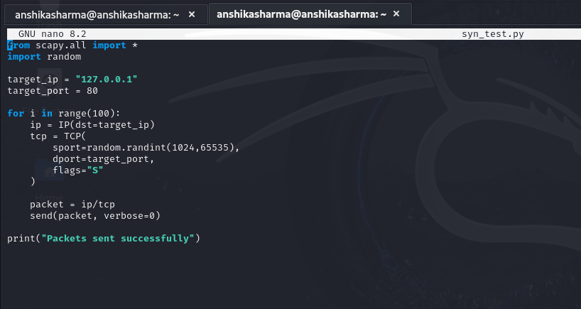
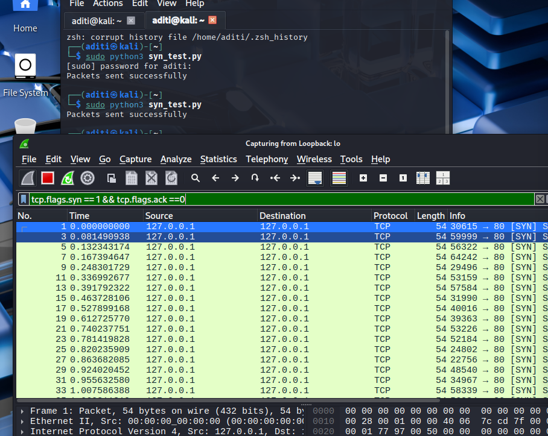
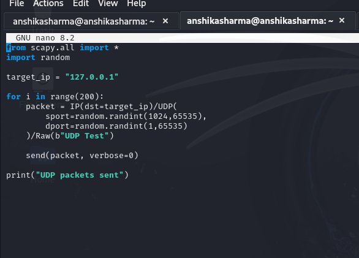
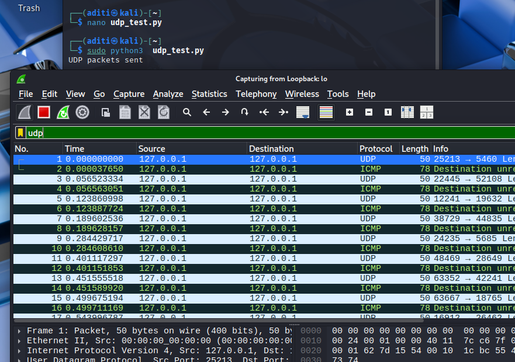

# Network Security Assignment 1 — DDoS Attack Simulation

**Name:** Anshika Sharma
**Batch:** B3 (CSF)
**Subject:** Network Security

---

## Objective
Simulate SYN Flood and UDP Flood DDoS attacks using Python (Scapy)
and analyze the network traffic using Wireshark.

---

## Tools Used
- Kali Linux Virtual Machine
- Python 3
- Scapy Library
- Wireshark Packet Analyser

---

## Attack 1 — SYN Flood

### Objective
Generate TCP SYN packets using Python and analyze the traffic pattern using Wireshark.

### Lab Setup
- Kali Linux VM
- Python with Scapy library installed
- Wireshark capturing packets on loopback interface

### Code


### Wireshark Output


### Analysis
A Python script was created using Scapy to generate TCP SYN packets directed
toward port 80 of the localhost. Wireshark captured multiple TCP packets with
the SYN flag enabled and ACK flag not set, indicating that the TCP three-way
handshake was never completed. This pattern is characteristic of a SYN Flood
attack where the server's connection table gets exhausted.

---

## Attack 2 — UDP Flood

### Objective
Generate UDP packets using Python and analyze the packet behavior using Wireshark.

### Lab Setup
- Kali Linux VM
- Python with Scapy library installed
- Wireshark capturing packets on loopback interface

### Code


### Wireshark Output


### Analysis
A Python script was used to generate a large number of UDP packets with random
source and destination ports directed at the localhost. Wireshark captured high
volume UDP traffic along with ICMP "Destination Unreachable" messages, which
appeared because packets were sent to closed ports. This behavior reflects the
characteristics of a UDP Flood attack where the target system is overwhelmed
with UDP traffic.

---

## How to Run

Install the required library:
```bash
pip install scapy
```

Run SYN Flood Attack:
```bash
sudo python3 SYN_Flood_Attack.py
```

Run UDP Flood Attack:
```bash
sudo python3 UDP_Flood_Attack.py
```

---

## Conclusion
In this experiment, network traffic resembling SYN Flood and UDP Flood attacks
was generated using Python and analyzed using Wireshark. The packet captures
clearly demonstrated how such attacks create abnormal traffic patterns in a
network. This experiment helped in understanding how denial-of-service attacks
function and how Wireshark can be used to detect such activities.

---

## Disclaimer
This project is strictly for educational purposes only.
All tests were performed in a controlled lab environment.
